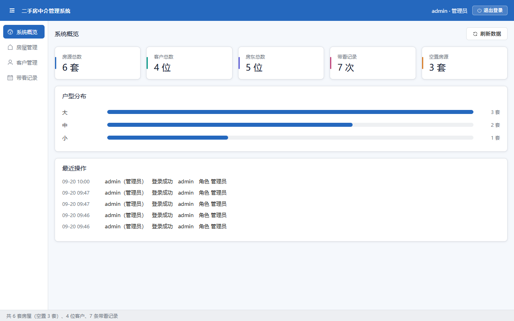
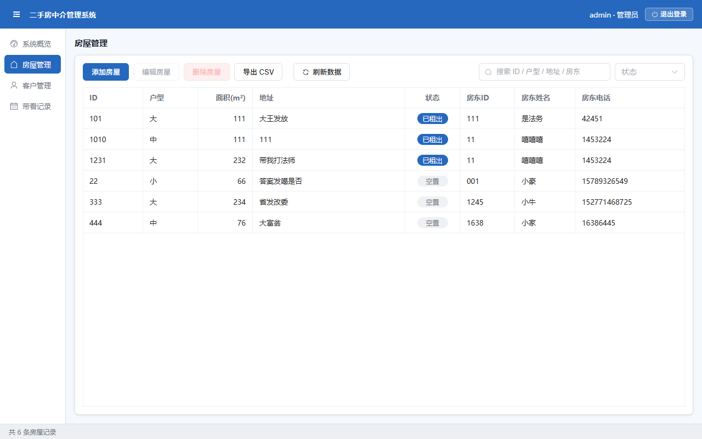
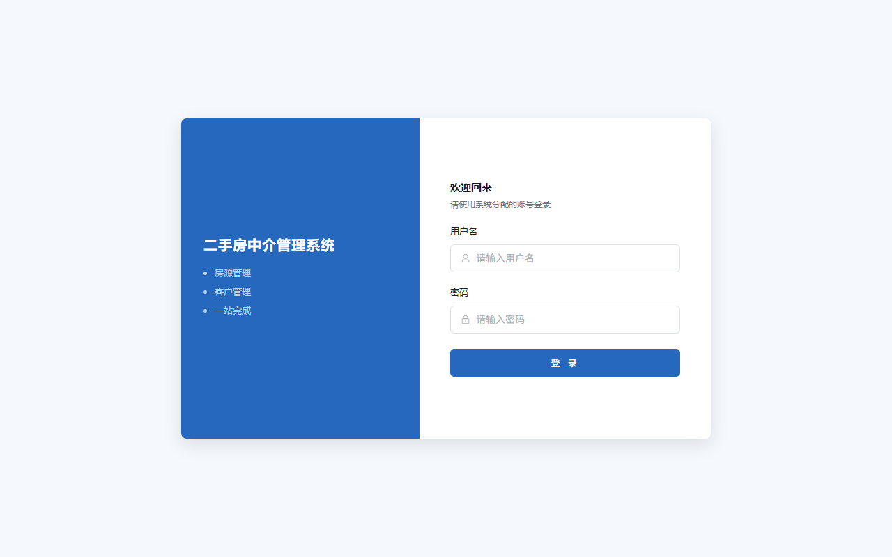

# 二手房中介管理系统

一套业务逻辑，两个界面 —— Java 桌面端 + 前后端分离的网页端。

房源、客户、房东、带看记录的管理系统，最初是一个 Java Swing + JDBC 的单机程序，
后来在不改动业务代码的前提下改造成了 Maven 多模块工程：**同一份 `realestate-core`
同时支撑 Swing 桌面端与 Spring Boot + Vue 3 的网页端**。

## 界面

网页端（Vue 3 + Element Plus）：







> 桌面端的配色、字号、圆角与这里完全一致（`ui/Theme.java` 与 `styles/theme.css` 逐项对应），
> 两端看起来是同一个产品，而不是「同一套后端配了两个各长各的前端」。

## 项目亮点

**一套业务逻辑，两个界面。** `realestate-core` 里只有 `javax.sql.DataSource` 与
`UserHolder` 两个 JDK 自带接口，**没有引入任何框架依赖**，所以它既可以被无框架的
Swing 程序直接调用，也可以被 Spring Boot 装配。这不是「顺手做到的」，而是整个改造
过程的硬约束 —— 一旦 core 里出现一个 Spring 注解，桌面端就得跟着进 Spring 容器。

**权限控制做两层。** 界面上按角色置灰按钮只是体验，真正的拦截在 core 的 Controller 里。
界面能被绕过，逻辑层不能。

**「当前用户」是可替换策略。** 桌面端同时只有一个登录用户，用静态字段即可；网页端每个
请求一个线程，必须用 ThreadLocal。`Session` 委托给 `UserHolder` 接口，两端各自注入实现，
而 core 里所有 `Session.can(...)` 的调用点一行都不用改。

**失败要能区分原因。** 校验不过 / ID 冲突 / 记录不存在 / 权限不足，在 core 里各带一个
`Kind`，到了网页端分别翻成 400 / 409 / 404 / 403。若都归成 400，调用方看到的文案一样、
根本分不清该改什么。

**「空」和「读不出来」严格分开。** 列表查询失败一律抛异常、绝不吞成空列表 ——
把数据库连不上显示成「暂无数据」，用户会以为数据丢了。

**密钥与口令从不入库。** 数据库口令、联系方式加密密钥、JWT 签名密钥都只存在于本机的
`db.properties`（已 gitignore），仓库里只有一份模板。

## 技术栈

| 层 | 选型 |
|---|---|
| 业务核心 | Java 21，无框架（`realestate-core`） |
| 桌面端 | Swing + FlatLaf 3.7.2 |
| 后端 | Spring Boot 3.5.16 + HikariCP + jjwt 0.12.7 |
| 前端 | Vue 3.5 + Element Plus 2.14 + Pinia + vue-router + Vite 8 |
| 数据库 | MySQL 8 |
| 构建 | Maven Wrapper 3.9.16（无需预先安装 Maven） |
| 接口文档 | springdoc-openapi 2.9.1（Swagger UI） |
| 测试 | 自研轻量断言框架（零新增依赖），core 260 项 + web 22 项；前端另有纯逻辑自检 32 项 |

## 目录结构

```
.
├── pom.xml                  父 POM（聚合三个模块）
├── mvnw / mvnw.cmd          Maven Wrapper
├── start-dev.cmd            双击一键起前后端（Windows）
├── db.properties.example    数据库 / 密钥配置模板（真实配置 db.properties 不入库）
├── realestate-core/         业务核心：model / dao / service / controller / util
├── realestate-desktop/      Swing 桌面端：desktop（入口）+ ui（主题与图标）+ view
├── realestate-web/          Spring Boot 服务端：controller / dto / config / security
├── frontend/                Vue 3 前端（独立于 Maven）
├── docs/images/             README 用截图
└── 需求报告.txt              需求、缺陷、风险、缺口的完整记录与变更历史
```

## 快速开始

**前置条件**：JDK 21、MySQL 8（跑网页端还需要 Node.js 18+）。

1. **准备数据库配置**

   ```bash
   cp db.properties.example db.properties
   ```

   填入数据库地址、账号与两个密钥（文件里写明了生成方式）。程序启动时会自动建库表并
   写入初始账号。

2. **构建**

   ```bash
   ./mvnw clean package          # 三模块构建 + 全部单元测试
   ./mvnw -DskipTests package    # 跳过测试
   ```

3. **跑网页端**（两个终端）

   ```bash
   # 终端 1：后端 :8080
   ./mvnw -pl realestate-web -am spring-boot:run

   # 终端 2：前端 :5173
   cd frontend
   npm install --registry=https://registry.npmmirror.com   # 首次
   npm run dev
   ```

   浏览器打开 <http://localhost:5173>。

   > Windows 上可直接双击仓库根的 `start-dev.cmd`，它会起两个服务并等它们都就绪后
   > 自动打开浏览器。

   > ⚠️ `-am` 不能省：`-pl` 只把选中模块放进构建，它依赖的 `realestate-core` 就只能从
   > 本地 Maven 仓库取，而仓库里那份可能已经过期，表现为一堆「找不到符号」。
   > 加 `-am` 会把 core 一并按源码构建。

4. **跑桌面端**（可选，与网页端共用同一套业务逻辑）

   ```bash
   ./mvnw -q -DskipTests install
   ./mvnw -pl realestate-desktop exec:java
   ```

   或直接跑打好的自包含 jar：

   ```bash
   java -jar realestate-desktop/target/realestate-desktop-1.0.0-SNAPSHOT-jar-with-dependencies.jar
   ```

5. **接口文档**

   后端启动后访问 <http://localhost:8080/swagger-ui/index.html>。
   先调 `POST /api/auth/login` 拿 token，再点右上角 **Authorize** 粘进去即可试调。
   对外部署时用 `APP_API_DOCS=false` 整体关掉。

## 默认账号

登录账号为 `admin`（管理员）与 `agent`（经纪人）。**初始口令不在这里重复记录** ——
源码与文档里出现明文口令是坏习惯，它们定义在 `DatabaseUtil.initializeDatabase()` 的
预设值中，首次建库时写入。

两个角色的差别只有一条：**经纪人不能删除数据**，其余（查看、新增、编辑、导出）相同。
删除是系统里唯一不可逆的操作。

## 接口概览

| 分组 | 接口 |
|---|---|
| 放行 | `GET /api/health`、`POST /api/auth/login` |
| 身份 | `GET /api/auth/me`、`POST /api/auth/logout` |
| 概览 | `GET /api/stats/overview` |
| 日志 | `GET /api/logs?limit=` |
| 房屋 | `GET\|POST /api/houses`、`PUT\|DELETE /api/houses/{id}`、`GET /api/houses/landlords`、`GET /api/houses/{id}/deletion-info`、`GET /api/houses/export` |
| 客户 | `GET\|POST /api/customers`、`PUT\|DELETE /api/customers/{id}`、`GET /api/customers/{id}/deletion-info`、`GET /api/customers/export` |
| 带看 | `GET\|POST /api/viewings`、`PUT\|DELETE /api/viewings/{id}`、`GET /api/viewings/options`、`GET /api/viewings/export` |

除放行的两个以外都需要 `Authorization: Bearer <token>`；响应统一为
`{code, message, data}`，成功时 `code` 为 0，失败时 `code` 与 HTTP 状态码一致。

## 测试

```bash
./mvnw test                                  # core 260 项 + web 22 项
cd frontend && npm run check                 # 前端纯逻辑自检 32 项
```

单元测试覆盖纯逻辑：密码加盐与旧格式兼容、权限映射与 fail-safe、输入校验、
关键字匹配、数值格式化、CSV 转义、带看结果与房屋状态的联动规则、查询筛选、JWT 签发与篡改。

需要连数据库或真实界面的验证另走「定向探针」与无头浏览器端到端脚本，
不混进单元测试 —— 它们依赖外部环境，不该让 `./mvnw test` 变得不可靠。

## 双轨演示

想证明「两个界面共用一套业务逻辑」，按这个顺序演示最直观：

1. **看结构**：打开 `realestate-core`，说明它不含任何界面库与框架依赖
   （`grep -r "javax.swing" realestate-core` 无结果）。
2. **跑网页端**：登录 → 新建一套房源 → 在房屋列表里搜到它。
3. **跑桌面端**：用同一个账号登录 → 同一套房源出现在列表里，
   概览页的数字与网页端完全一致。
4. **改一处规则**：例如在 core 的 `ViewingController` 里改一句校验文案，
   两个界面同时变成新文案 —— 业务规则只有一份。

## 已知取舍与遗留

- **未使用声明式事务**：Spring 的 `@Transactional` 要求取连接经过 `DataSourceUtils`，
  而本项目 DAO 自己取连接、自己关连接（core 不依赖框架）。目前事务边界只在单次复合写
  内部由 DAO 自己控制。替代路径见需求报告 G-021。
- **前端主包体积较大**：Element Plus 全量引入导致主 chunk 约 860 kB（gzip 275 kB）。
  改按需引入需要额外的构建期插件，暂未做（G-022）。
- **业务 ID 无字符集约束**：接口把它放在 URL 路径里，若 ID 含 `/` 会导致请求失败。
  现有数据都是数字串，实际不会触发（G-023）。
- **退出登录无法让 token 立即失效**：JWT 无状态，服务端不存会话，登出靠客户端丢弃 token。
  要强制失效需引入黑名单。
- **接口文档默认对外开放**：文档本身不含数据，但对外部署时应关闭。

完整的缺口清单、取舍理由与验证记录见 [`需求报告.txt`](需求报告.txt) ——
它按「需求 R-xxx / 缺陷 BUG-xxx / 风险 RISK-xxx / 缺口 G-xxx」编号，
每条都写了现象、成因、处理方式与验证结果，包括若干次出错与纠正的过程。
